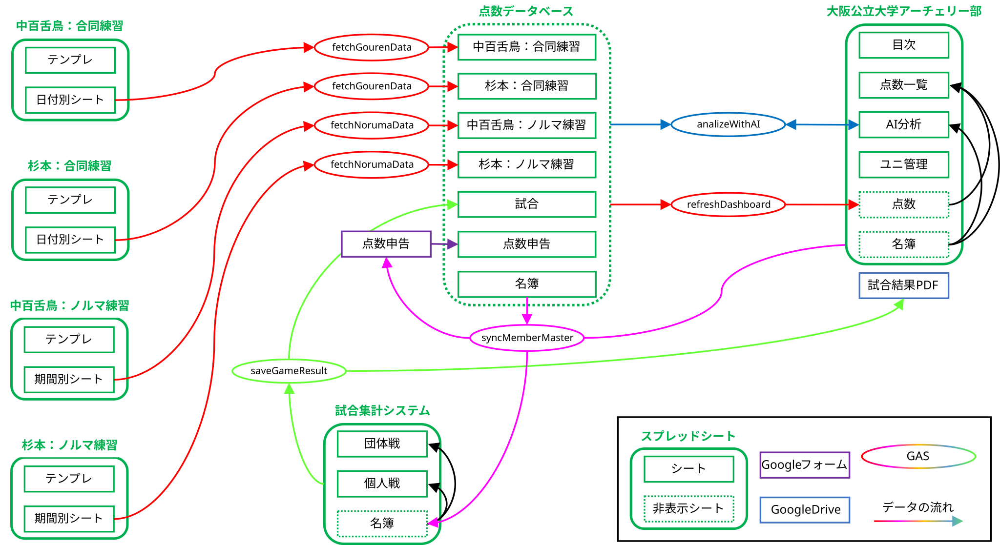

# AIMS(Archery-club Integrated Management System)

## 概要

アーチェリー部において，点数と出欠状況を集約・共有するためにGoogle Spreadsheet・Google Form・Google Apps Scriptを用いて構成されたシステム．

長期にわたって出欠と得点の閲覧を可能にすることで，自身の点数傾向の把握と練習内容の改善，キャンパス間の現状の把握などによる部全体の得点上昇を目的とする．

### 背景

点数が部室のバインダーのみで管理されており，自宅での確認や継続的な分析が困難であった．さらに，大学統合によって活動拠点が2カ所に分かれたことでキャンパス間の情報共有も必要となっていた．

## 主な機能

主な機能と使用方法については[AIMSマニュアル](https://yukiyamasaki6.github.io/aims-gas/)をご覧ください．

## システム構成

### 技術スタック

**フロントエンド:** Google Spreadsheet / Google Form

部員が日常的にアクセス・操作しやすく，導入コストを最小限に抑えられるため．

**バックエンド:** Google Apps Script (GAS)

Googleスプレッドシートやフォームとの親和性が極めて高く，サーバーレスで運用コストを抑えられるため．

**データベース:** Google Spreadsheet

非エンジニアの部員が運用者となった際でも管理しやすく，GASやフォームとの連携も容易であるため．
部内の点数管理のデータ規模であれば，スプレッドシートのパフォーマンスも十分であると判断した．

### アーキテクチャ

## 課題と解決アプローチ

- **課題1:** PCとスマホの両方からアクセスするため，どちらでも使いやすいUIが必要

  **解決策:** スプレッドシートのレイアウトを工夫し，スマホからの入力も考慮した設計にする．例えば，縦方向のレイアウト・文字サイズの調整・プルダウンリストの活用などを行った．

- **課題2:** ダッシュボードに全ての点数を表示すると，スプレッドシートのパフォーマンスが低下する

  **解決策:** ダッシュボードには最新の点数と最高点数のみを表示し，過去の点数は別のシートに保存するようにした．これにより，ダッシュボードのパフォーマンスを維持しつつ，過去のデータも参照できるようにした．

- **課題3:** 点数の入力からダッシュボードへの反映までをリアルタイムで行いたいが，部員の入力ごとにスクリプトが実行されると，累計実行時間を超過する可能性がある

  **解決策:** 点数のデータベースとダッシュボードへの同期をトリガーで定期的に行うようにした．これにより，リアルタイム性は多少犠牲になるが，スクリプトの実行時間を抑えられた．

- **課題4:** AIによる点数分析を行う際に，平均の算出や距離ごとの換算を行う必要があるが，AIは平均や換算を正しく行えない場合がある

  **解決策:** AIに渡す前に，GASで平均や換算を行い，AIには統計値を分析し，言語化することに専念させるようにした．これにより，AIの出力精度を向上させることができた．

## 今後の展望

レイアウトの工夫などによってスマホからも入力しやすいUIを実現したが，点数を入力するだけなのにキーボードを開く必要があるなど，まだ改善の余地があると感じている．また，1射ごとの点数記録など，より詳細な記録と高度な分析も可能にしたいと考えている．

これらの点を改善するために，現在はTypeScriptとReactを用いたPWA（Progressive Web App）への移行を進めている．
